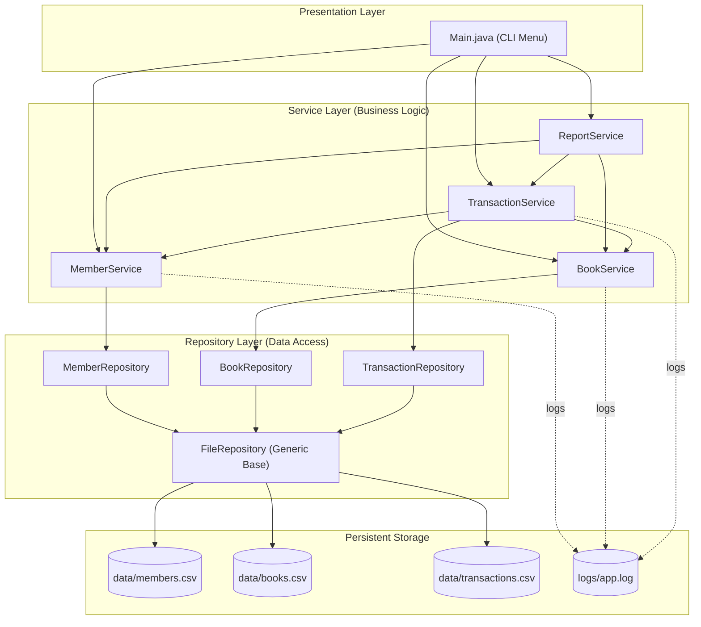

# Design Documentation

## 1. Problem Statement, Objectives, Functional & Non-Functional Requirements

The problem statement, project scope, target users, and motivating features are described in [ statement.md ]( statement.md ).

### 1.1 Objectives

Apply fundamental object-oriented programming principles, including encapsulation, inheritance, and interface/functional types to implement a library-management information system.
Design and demonstrate an application with a layered architecture, clearly distinguishing between data model, persistence, business logic, and presentation tiers.
Deliver a standalone application that runs in a terminal window, does not require external dependencies, and is completely self-contained.
Persist data in a reliable manner, supporting basic record-keeping for the library.
Ensure correct data is entered and processed by implementing validation and exception handling mechanisms.
Provide essential reporting and analytical features to help the library staff manage the collection and operations.

### 1.2 Functional Requirements

1.1 Members: add, view, update, deactivate, delete members.
1.2 Books: add, view, search, update, delete books, including tracking of total and available copies.
1.3 Transactions: issue, return, overdue fine calculation, and listing of overdue books.
1.4 Reporting: generate reports and analytics about the collection and its usage.

### 1.3 Non-Functional Requirements

Requirement Implementation
Performance In-memory HashMap based repository pattern is used to assure high performance during data access by ID as data is loaded from CSV files on application startup.
Reliability Data is serialized into CSV files to assure its reliability between different execution of the application; any problems related to corrupt or faulty files are solved
Usability The application has menu-based command line interface with useful prompts and error messages.
Maintainability Layered architecture is applied physically dividing model, repository, service and presentation logic layers.
Data Integrity Separate validation classes are used by the application to validate user inputs and business rules.
Error Handling Custom exceptions and failure handling approaches suggested by Clean Architecture are implemented.
Logging/Monitoring Logging utility is used to log important events into logs/app.log file.
Scalability Generic repository pattern is applied to assure possibility to add new entity types.

## 2. System Architecture Diagram

The application has a layered architecture. This diagram represents the key components and their relationships:

### Layer Responsibilities

Presentation collecting layer: Works with the user using the command line interface.
Service layer: Serves as a basis for the business logic of the application.
Repository layer: Has all the necessary ways to work with the data.
Data storage: The data is kept in CSV format.
